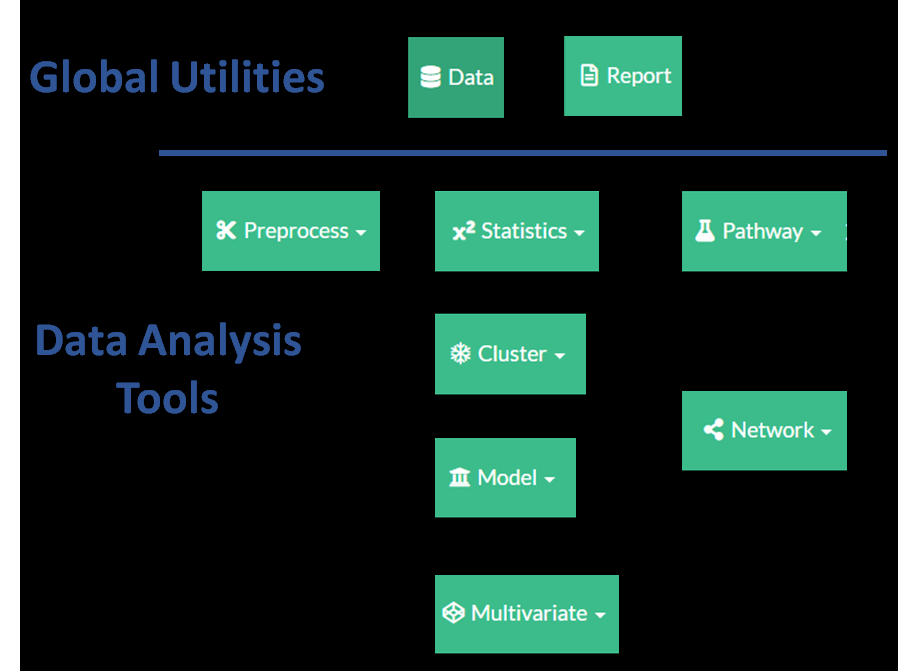
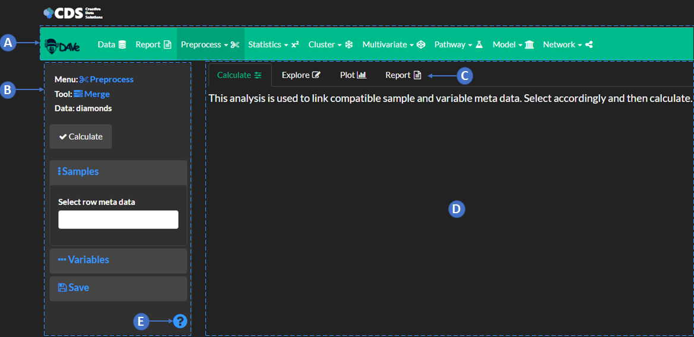

```{r,echo=FALSE}
shiny::includeCSS(system.file('partial/www/css/styles.css',package="dave.help"))

```

```{r,echo=FALSE,message=FALSE}

library(dave.help)

```


##  `r dcr_b('Quick Start')`



#### DAVe is comprised of individual `r dcr_g('modules')` which can be linked to create a variety of unique data analysis workflows. The `r dcr_b('Global Utilities')` include `r dcr_g('Data')` and `r dcr_g('Report')` and provide an overview of objects shared by the `r dcr_b('Data Analysis Tools')`. The majority of analyses start with data upload using the `r dcr_g('Data')` module and then preparation using `r dcr_g('Preprocess')`. Check out the `r dcr_b('Analysis Workflows')` section for more examles.




<br>

<div class='numberCircle'>A</div>
<div class="txbox_blue"> <h3>Select Modules</h3></div>
<br>
<h4> The navigation bar is used to select different analyses. Each analysis may also have sub-options. Typical workflows will include choosing modules from the nav bar progressing from left to right and while optimizing each step with sub analyses by progressing through each modules method controls from top to bottom. See the `r dcr_b('Analysis Workflows')` section for details how to save and propogate results between induvidual modules.
</h4>


<br>

<div class='numberCircle'>B</div>
<div class="txbox_blue"><h3> Module Controls</h3></div>
<br>
<h4> The sidebar is used to select analyses methods, tune visualizations and specify report options.</h4>

<br>

<div class='numberCircle'>C</div>
<div class="txbox_blue"><h3>Progress Analyses</h3></div>
<br>

<h4>The tabpanel can be used to switch between calculation, interactive exploration, static plotting and report generation. Use  `r dcr('calculate')` to select method options and generate data objects. `r dcr('Explore')` provides interactive visualizations, while `r dcr('plot')` is used to tune how the visualizations will appear in the `r dcr('report')`. The `r dcr('report')` tab is used to collect all methods, results and plot settings and generate a report of methods and results. The `r dcr('report')` may also include additional information not present in the previous tabs and can be dynamically populated based on user selected visualizations. All analyses report results can be combined and further manipulated in navbar `r dcr_g('Report')` module.
</h4>
  
<br>
  
<div class='numberCircle'>D</div> 
<div class="txbox_blue"> <h3>Results and Methods</h3></div>
<br>
<h4> This is the main panel where calculation, exploration, plotting and report results will be output to. Results may include both static and interactive results which can be manipulated further.
</h4>

<br>

<div class='numberCircle'>E</div> 
<div class="txbox_blue"> <h3>Help</h3></div>
<br>
<h4> Select this icon to to view the help menu for each selected analyses.
</h4>