```{r,echo=FALSE}
shiny::includeCSS(system.file('partial/www/css/styles.css',package="dave.help"))

```

```{r,echo=FALSE,message=FALSE}

library(dave.help)

```

## `r dcr_b('Analysis Workflows')`

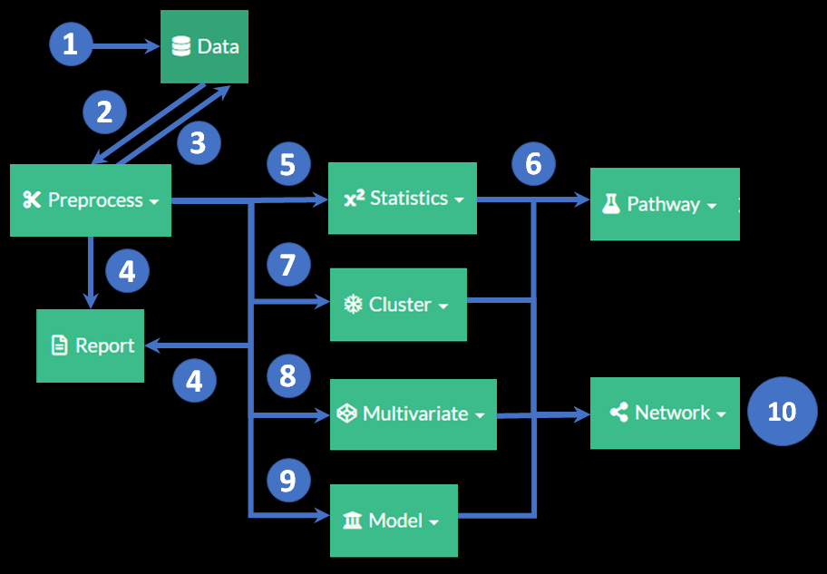

<br>

#### Each module shares internal workflow elements. The analyses proceed using the `r dcr('calculate')` tab to set the methods and get results. 

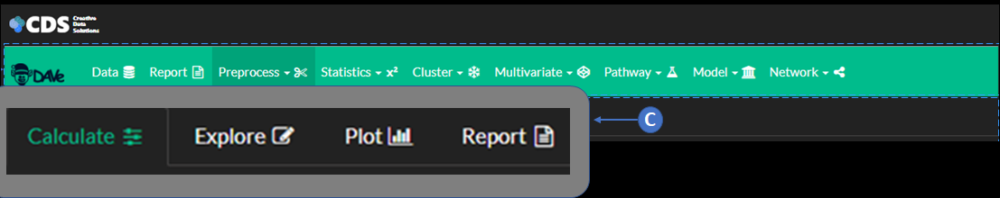

#### The results can be visualized using static `r dcr('plot')` or interactive `r dcr('explore')` tabs. The methods, results and created visualizations can be summarized in the `r dcr('report')`. This can be done iteratively to explore and refine the analysis results and summaries. Once the results reached the data object can be `r dcr('saved')` using the controls at the bottom of the `r dcr('calculate')` menu.

<div class='numberCircle'>1</div> 
<div class="txbox_blue"> <h3>Upload Data</h3></div><br>
<br>
<h4> Load data from a `.csv` or saved project.
</h4>

<div class='numberCircle'>2</div> 
<div class="txbox_blue"><h3>Prepare Data</h3></div><br>

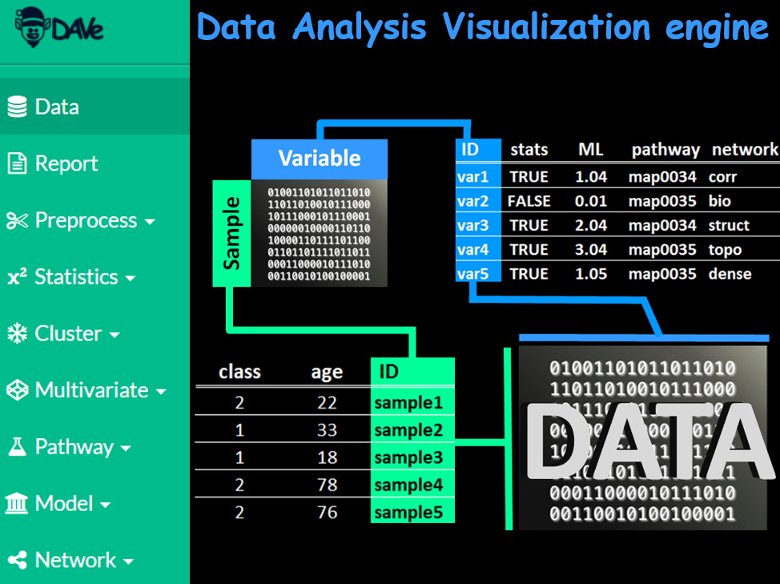

<br>
<h4> Use the `r dcr_g('Preprocess')` module to specify sample meta data and merge with variable information. Review and impute missing values.
</h4>

<div class='numberCircle'>3</div> 
<div class="txbox_blue"> <h3>Save Results</h3></div><br>
<br>
<h4> Each modules calculations and results can be saved and used in further analyses. The `r dcr('save')` controls found at the bottom of each module\'s controls menu can be used to specify various parameters to add to the global data sets.
</h4>

<div class='numberCircle'>4</div> 
<div class="txbox_blue"> <h3>Generate Reports</h3></div>

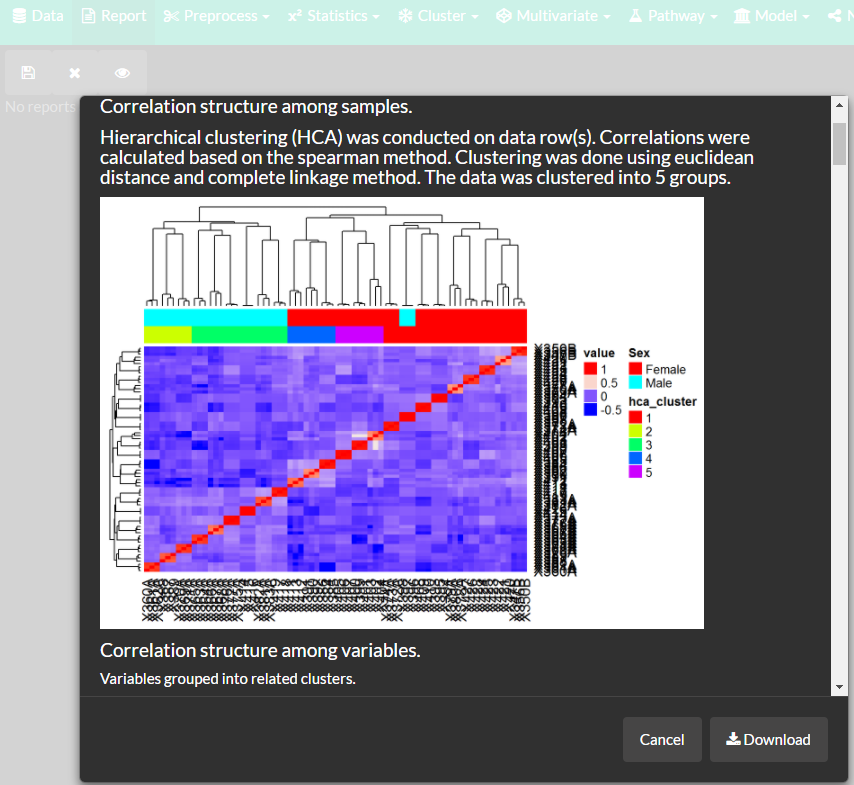

<h4> Each modules results, methods and visualizations can be saved to the analysis `r dcr('report')`. Individual module\'s reports can be combined and further modified using the global `r dcr_g('report')` module.
</h4>

<div class='numberCircle'>5</div> 
<div class="txbox_blue"> <h3>Statistical Analysis</h3></div>
<br>
<br>
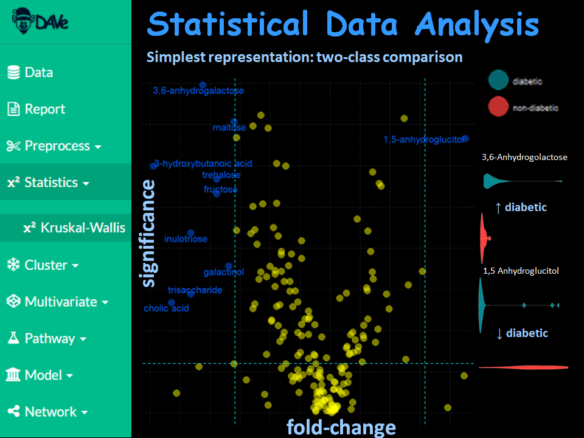
<h4> The `r dcr_g('statistics')` module can be used to compare changes in variables among groups of samples and calculate summary statistics.
</h4>

<div class='numberCircle'>6</div> 
<div class="txbox_blue"> <h3>Pathway Analysis</h3></div>
<br>
<br>
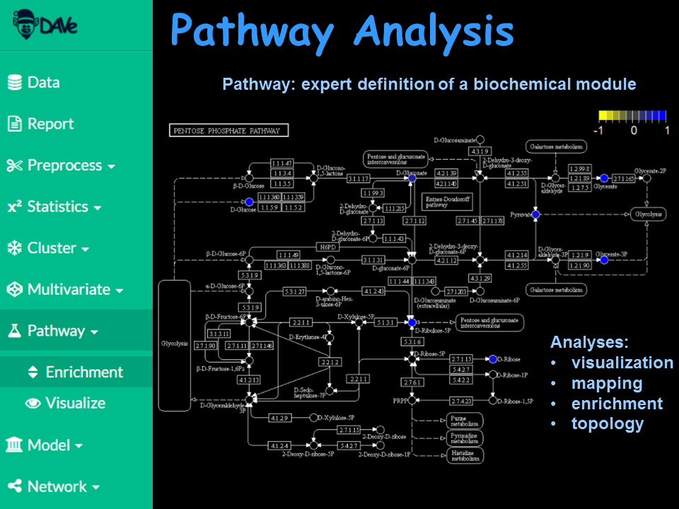
<h4> The p-values and fold changes calculated `r dcr_g('statistics')` module can be used to calculate pathway enrichment. The enriched pathways can be visualized to show the direction of significant changes in variables mapped to biochemical pathways.
</h4>

<div class='numberCircle'>7</div> 
<div class="txbox_blue"> <h3>Clustering</h3></div>
<br>
<br>
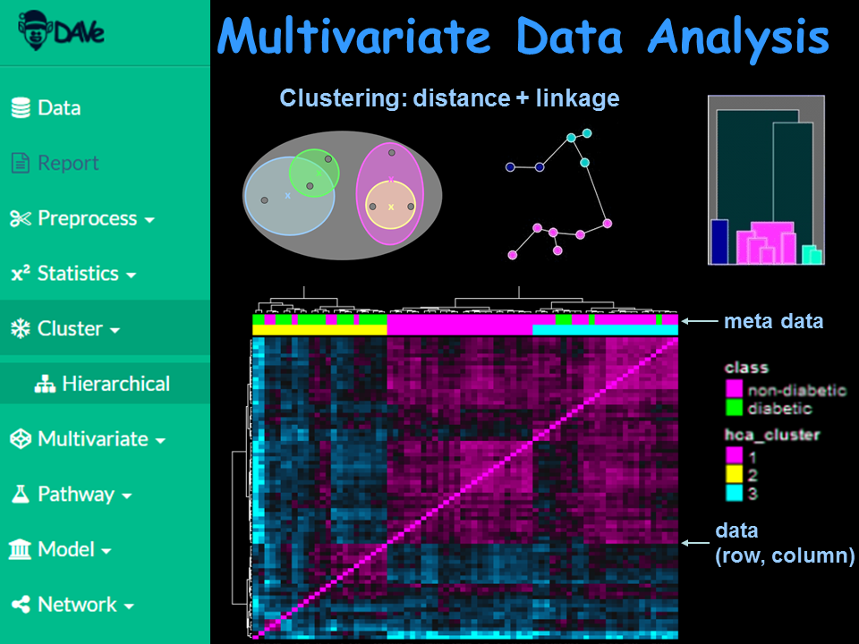
<h4> 
Use the `r dcr_g('cluster')` module to identify groups of related samples or variables. Use `r dcr_g('Hierarchical Clustering (HCA)')` on the full data or sample and variable correlation. Visualize meta data and cluster relationships with heatmaps and dendrograms.
</h4>

<div class='numberCircle'>8</div> 
<div class="txbox_blue"> <h3>Dimensional Reduction</h3></div>
<br>
<br>
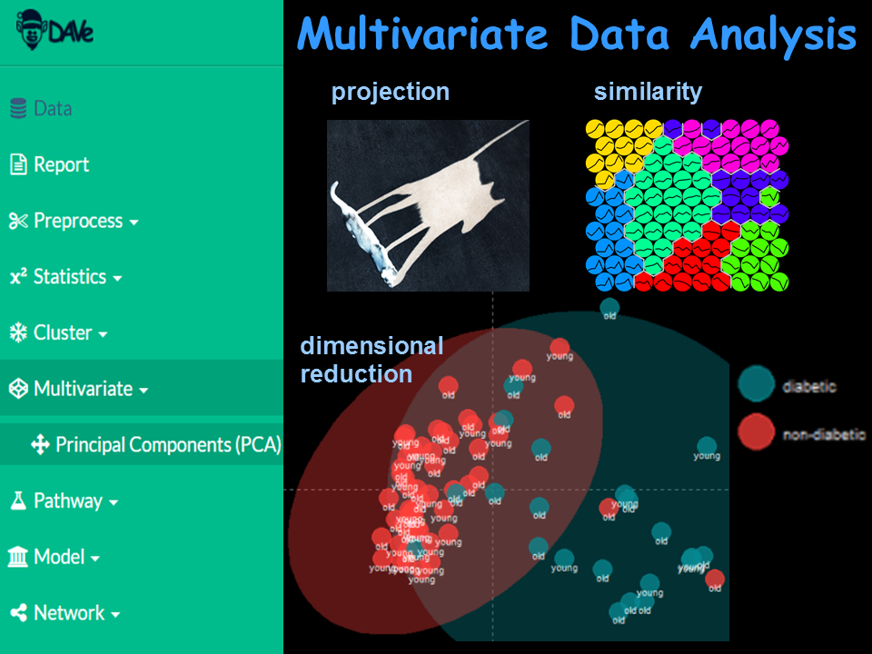
<h4> 
Use the `r dcr_g('multivariate')` module to calculate lower dimensional summaries of multivariate data. Use `r dcr_g('Principal Components Analysis (PCA)')` to visualize the major modes of variance in samples, variables and their correlations.
</h4>

<div class='numberCircle'>9</div> 
<div class="txbox_blue"> <h3>Predictive Modeling</h3></div>
<br>
<br>
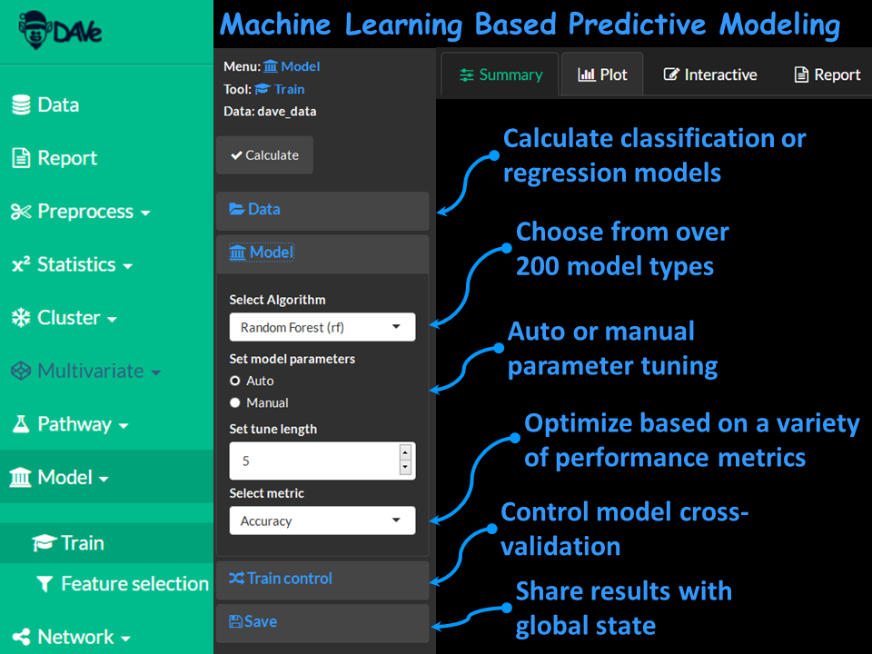
<h4> 
Use the `r dcr_g('model')` module to calculate `r dcr_g('machine learning (ML)')` models to identify predictive relationships for groups or continuous variables. Use auto ML to optimize and tune models while choosing from over 200 available algorithms. Carry out feature selection to rank important variables for explaining the model performance.
</h4>


<div class='numberCircle'>10</div> 
<div class="txbox_blue"> <h3>Network Analysis and Mapping</h3></div>
<br>
<br>
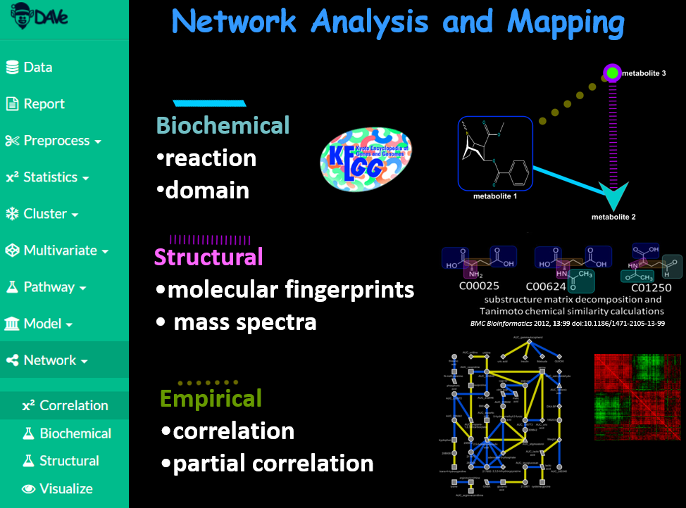
<h4> 
Use the `r dcr_g('network')` module to identify `r dcr_g('biochemical')`, `r dcr_g('structural similarity')` and `r dcr_g('regularized correlation')` relationships between variables.</h4>
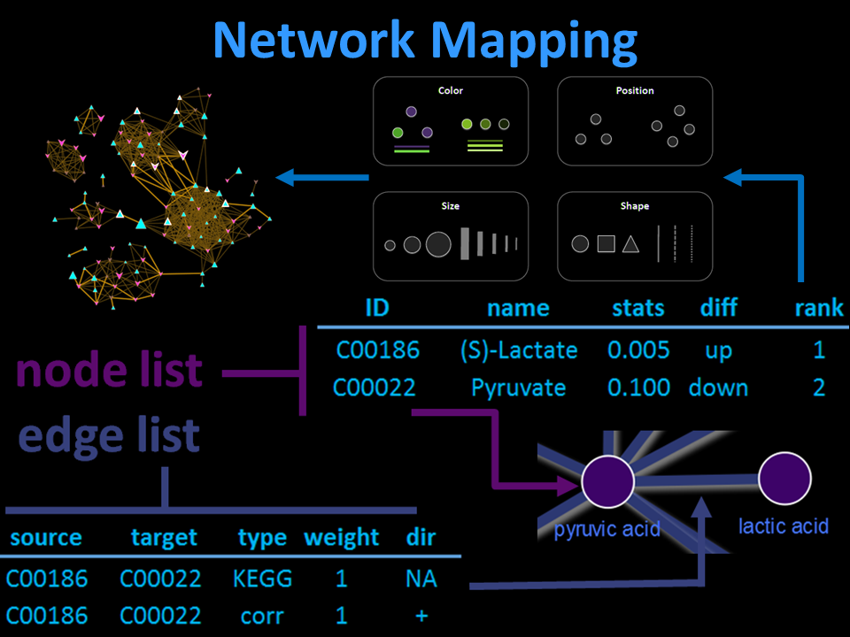

<h4>
Use the `r dcr_g('network')` module to combine the results from other modules by using `r dcr_g('network mapping')` to visualize meta data, statistical, clustering, dimensional reduction, predictive modeling and pathway analysis results. Use highly interactive network visualizations to fine tune publication quality static graphics.
</h4>
